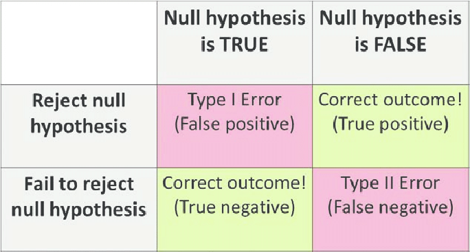

# Statistical Inference {#inference}

```{r ch4-setup, include=FALSE}
# Load required packages
library(ggplot2)

knitr::opts_chunk$set(
  echo = TRUE,
  message = FALSE,
  warning = FALSE,
  collapse = TRUE,
  cache = TRUE,
  fig.width = 6,
  fig.asp = 0.618,
  out.width = "70%",
  fig.align = "center"
)
```

> "To consult the statistician after an experiment is finished is often merely to ask him to conduct a post mortem examination. He can perhaps say what the experiment died of."
>
> --- Sir Ronald Fisher

Suppose you are moving to Ames, Iowa and are considering buying a home. How would you know whether or not the house you are considering is averagely priced, significantly more expensive, or significantly less expensive? With all of the data available on the web, it is possible to gather data selling prices of similar homes in the area. From this data, which we call a *reference distribution*, it can be determined whether or not the price of a particular home is on par with similar homes in the neighborhood. 

Say, for example, the price of a new home for sale in Ames, Iowa is `r scales::dollar(610000)`. Using historical data, we can compare this price against a reference distribution. This is illustrated in the code chunk below using the `ames` data frame.

```{r}
Sale_Price <- AmesHousing::make_ames()$Sale_Price
(610000 - mean(Sale_Price)) / sd(Sale_Price)  # compute a z-score
```

So a house costing `r scales::dollar(610000)` is more than five standard deviations beyond the mean of all the houses sold between the years 2006 and 2010---of course, a more fair comparison would only involve houses with similar features (e.g., a fireplace, finished basement, same neighborhood, etc.). 

Classical statistical inference (e.g., *significance testing*) is a similar process. An investigator or analyst considers the result from a particular experiment and wants to know whether or not the result is *statistically significant*^[Keep in mind that a statistically significant result does not necessarilly imply a *practically significant* result (recall the importance of specifying effect sizes).] (e.g., due to the varying experimental conditions), or due to chance alone. In order to make this conclusion, a relative reference set is required that characterizes the outcome if the varying experimental factors truly had no impact on the result. The observed outcome can then be compared to this reference distribution and the statistical significance of the result can be quantified. This approach to statistical inference is called the *frequentist* approach---in contrast to *Bayesian inference* which is not discussed in this book.


## The frequentist approach

The most common methods in statistical inference are based on the frequentist approach to probability. Many of the common statistical tests, like the one-sample $t$-test, follow the same paradigm: compute a test statistic associated with the population attribute of interest (e.g., the mean), determine it's *sampling distribution*, and use the sampling distribution to compute a $p$-value, construct a *confidence interval*, etc.

The sampling distribution of a statistic (e.g., a test statistic), based on a sample of size $n$, is the distribution obtained after taking every possible sample of size $n$ from the population of interest and computing the sample statistic for each; see, for example, Figure \@ref(fig:sampling-distribution).

```{r sampling-distribution, echo=FALSE, fig.cap="Frequentist approach to sampling and sampling distributions."}
knitr::include_graphics("illustrations/sampling-distribution.png")
```

In some cases, the sampling distribution of the statistic is known, provided certain assumptions are met (like independent observations and normality). For example, consider a random sample $x_1, x_2, \dots, x_n$ from a normal distribution with mean $\mu$ and variance $\sigma ^ 2$. As it turns out, the statistic
\begin{equation}
  z_{obs} = \frac{\bar{x} - \mu}{\sigma / \sqrt{n}},
  (\#eq:zobs)
\end{equation}
has a standard normal distribution. From this sampling distribution, we can formulate a confidence for the true mean $\mu$, or test specific hypotheses. In practice, $\sigma$ is unknown and is estimated using the sample standard deviation, $s$. Replacing $\sigma$ with $s$ in Equation \@ref(eq:zobs) results in another statistic, called the $t$-statistic, and is given by
\begin{equation}
  t_{obs} = \frac{\bar{x} - \mu}{s / \sqrt{n}}.
  (\#eq:tobs)
\end{equation}
@student-probable-1908 showed that $t_{obs}$ follows a $t$-distribution with $n - 1$ *degrees of freedom*.

In more complicated examples, the sampling distribution of a statistic is not known, or is rather complicated (e.g., the correlation coefficient or the ratio of two means), but can be simulated through a process called the *booststrap*, which we discuss in \@ref(bootstrap).


### The central limit theorem

One of the most common goals in classical statistical inference is to make inference regarding the mean of a population: 
$$
  H_0: \mu = \mu_0 \quad vs. \quad H_1: \mu \ne \mu_0,
$$
where $\mu$ is the true population mean and $\mu_0$ is some hypothetical value. Assume we have a random sample $x_1, x_2, \dots, x_n$ from the population of interest. If the data are normally distributed, we can test this hypothesis using a standard $t$-test (discussed later). If the data are not normally distributed, then the *central limit theorem* (CLM) tells us that the sampling distribution of the sample mean (or more simply the sample total) will be approximately normal for sufficiently large $n$. How large does $n$ need to be? The answer depends on how far the true distribution deviates from normality! A common rule of thumb, though not always adequate, is that $n > 30$ is sufficient to invoke the CLM. For instance, as we saw in Chapters 2--3, the distribution of `Sale_Price` is quite skewed to the right. However, the sampling distribution of the mean from this population will be approximately normal provided $n$ is sufficiently large. For example, we simulated `r prettyNum((nsim <- 10000), big.mark = ",")` sample means from `Sale_Price` based on sample of various sizes. The resulting sampling distributions are displayed in Figure \@ref(fig:sale-price-clm). Clearly, the sampling distribution becomes more bell-shaped and normal looking as the sample size increases; for this population, $n = 30$ seems sufficient.
```{r sale-price-clm, echo=FALSE, fig.cap="Sampling distribution of mean sale price based on samples of size $n = 5$ (top left), $n = 10$ (top right), $n = 30$ (bottom left), and $n = 100$ (bottom right)."}
# Simulate sampling distributions
nsim <- 10000
set.seed(1600)  # for reproducibility
sim_5 <- replicate(nsim, mean(sample(Sale_Price, size = 5)))
sim_10 <- replicate(nsim, mean(sample(Sale_Price, size = 10)))
sim_30 <- replicate(nsim, mean(sample(Sale_Price, size = 30)))
sim_100 <- replicate(nsim, mean(sample(Sale_Price, size = 100)))
sim <- data.frame(result = c(sim_5, sim_10, sim_30, sim_100),
                  n = rep(c(5, 10, 30, 100), each = nsim))
sim$n <- paste0("n = ", sim$n)
sim$n <- factor(sim$n, levels = c("n = 5", "n = 10", "n = 30", "n = 100"))

# Plot results
ggplot(sim, aes(x = result)) +
  geom_histogram(bins = 30) +
  facet_wrap(~ n, scales = "free_x") +
  xlab("Sample mean")
```

The classical tests and procedures discussed in this chapter assume that we are sampling from populations that are infinitely large. In most cases, however, the populations from which we obtain samples are finite. 

### Hypothesis testing

Univariate statistical tests of hypotheses usually concern a single parameter, say $\theta$. For instance, $\theta$ could be the mean of a single population (i.e., $\theta = \mu$), or the difference between the means of two populations (i.e., $\theta = \mu_1 - \mu_2$). The *null hypothesis*, denoted $H_0$, represents the status quo of $\theta$ and the alternative hypothesis, denoted $H_1$ or $H_a$, represents the research hypothesis regarding $\theta$. For instance, in comparing the means of two populations, we may be interested in testing
$$
H_0: \mu_1 - \mu_2 = \delta_0 \quad \text{vs.} \quad H_1: \mu_1 - \mu_2 \ne \delta_0,
$$
where $\delta_0$ is some hypothetical value (usually $0$ signifying no difference in the means of the two populations). To carry out such tests, we require an estimate of $\theta$, say $\widehat{\theta}$, and its corresponding sampling distribution.


### One-sided versus two-sided tests

The previous hypothesis test involved a two-sided alternative (i.e., $H_1: \mu_1 - \mu_2 \ne \delta_0$). Such a test is called a *two-sided test*. It is possible, though less common, to use a one-sided alternative of the form
$$
H_1: \theta < \theta_0 \quad \text{or} \quad H_1: \theta > \theta_0
$$
A word of caution regarding one-sided alternatives is to avoid them! These are more common in experimental studies where *a priori* information is available suggesting that the population attribute of interest is either less than or greater than some hypothetical value. Although the proceeding discussions apply specifically to two-sided tests, the methodology can easily be amended to accommodate one-sided tests.


### Type I and type II errors

Statistical significance testing relies on the *presumption of innocence*. That is, we fail to reject the null hypothesis unless the data provide sufficient evidence to say otherwise. For example, in the US criminal justice system, the defendant is assumed innocent until proven guilty:
$$
H_0: \text{Defendant is innocent} \quad \text{vs.} \quad H_1: \text{Defendant is guilty}
$$
Whenever we conduct a statistical test of hypothesis, a decision is made regarding the null hypothesis. Since this is a binary decision, there are four possible outcomes, two of which are errors:

1. Convict the defendant when the defendant is guilty (a good decision)

2. Convict the defendant when the defendant is innocent (a bad decision)

3. Fail to convict the defendant when the defendant is guilty (a bad decision)

4. Fail to convict the defendant when the defendant is innocent (a good decision)

Which decision is worst? Naturally, it would be worse to convict an innocent person than to let a guilty person go free. We call the first type of error a *type I error*, and the second a *type II error*. Furthermore, we denote the probability of making a type I error as $\alpha$ and the probability of making a type II error as $\beta$. The classic approach to statistical testing fixes the probability of making a type I error ahead of time (e.g., $\alpha = 0.05$), we then do our best to reduce the risk of making a type II error.  

```{r, fig.cap="Type I versus type II errors.", echo=FALSE, out.width="80%", out.height="80%"}

```

### Power analysis

Mitigating the probability of making a type II error involves minimizing $\beta$; however, it is most common to discuss this in terms of *power analysis*.  The *power* of any test of statistical significance is defined as the probability that it will reject a false null hypothesis and is inversely related to $\beta$.

$$
\text{power} = 1 - \beta
$$

Power analysis is an important aspect of experimental design. It allows us to determine the sample size required to detect an effect of a given size with a given degree of confidence.  To conduct a power analysis, we generally need three of the following four quantities:

1. sample size
2. effect size - magnitude of the difference we desire to see
3. significance level ($\alpha$)
4. power ($1-\beta$)

Often, in practice we have determined the magnitude of the effect size we desire to see for practical business impact and the level of confidence we have in our inference (provided by the various significance criterions: $\alpha$, $\beta$, and power).  Consequently, we can use these units of measure to estimate the sample size required for our hypothesis testing.  For example, assuming a two-sample t-test, the required sample size is given by

$$
n_i \ge 2\bigg( \frac{z_{1-\alpha/2} + z_{1-\beta}}{ES} \bigg)^2
$$

where $n_i$ is the sample size required in each group ($i=1,2$), $\alpha$ is the selected level of significance and $z_{1-\alpha/2}$ is the value from the standard normal distribution, and $1-\beta$ is the selected power and $z_{1-\beta}$ is the value from the standard normal distribution. $ES$ is the effect size, defined as:

$$
ES = \frac{|\mu_1 = \mu_2|}{\sigma}
$$
where $|\mu_1 = \mu_2|$ is the absolute value of the difference in means between the two groups *expected* under the alternative hypothesis, $H_1$. Figure \@ref(fig:power-analysis) illustrates the relationship between the effect size we desire to confidently identify exists or not and the resulting sample size required to adequately detect this effect.

```{r power-analysis, echo=FALSE, fig.cap="Relationship between effect size and sample size via power analysis."}
library(dplyr)
library(purrr)

delta <- seq(0.001, 40, by = 0.05)

pwr <- function(x) {
  power <- power.t.test(delta = x, power = .8, sig.level = 0.05)
  power$n
}

delta %>%
  map_dbl(~ pwr(x = .x)) %>%
  data_frame(n = ., delta = delta) %>%
  ggplot(aes(n, delta)) +
  geom_line() +
  scale_x_log10("Sample size required", labels = scales::comma) +
  ylab("Effect size")
```


Power analyses and sample size calculations, differ depending on the type of hypothesis test (i.e. one-sided versus two-sided t-test, continuous versus binary responses) and are beyond the scope of this book (the classic reference is @cohen-statistical-1988). However, in section \@ref(abtesting) we illustrate how a power analyis helps inform A/B testing procedures.


### $p$-values 

There are three equivalent approaches to conducting hypothesis tests:

1. The *rejection region* approach (the least informative).

2. The $p$-value approach.

3. The *confidence interval* approach.

The latter two are the most informative as they provide information beyond our decision to simply reject or fail to reject a null hypothesis. This section discusses $p$-values.

$p$-values provide a measure of evidence in favor of or against the null hypothesis. The $p$-value, denoted $p$, can be thought of as the *observed significance level*. We would reject the null hypothesis at the $\alpha$ level of significance whenever $p < \alpha$. Table \@ref(tab:p-values) provides a general guideline for interpreting $p$-values.

| Result              | Interpretation                        | 
|:-------------------:|:--------------------------------------|
| $p \le 0.01$        | Very strong evidence against the null |
| $0.01 < p \le 0.05$ | Strong evidence against the null      |
| $0.05 < p \le 0.10$ | Moderate evidence against the null    |
| $0.10 < p \le 0.20$ | Weak evidence against the null        |
| $p > 0.20$          | No evidence against the null          |

Table: (\#tab:p-values) p-values.

To put another way, $p$-values tell us the smallest value of $\alpha$ that would result in rejecting the null hypothesis. Keep in mind, however, that it is highly unethical to change $\alpha$ after comparing it to the $p$-value in order to change the resulting decision of the test---the significance level should be stated before the data are inspected, or even collected, and never be changed thereafter. To compute a $p$-value, we need to be able to compute probabilities from the sampling distribution of the test statistic under the assumption that the null hypothesis is true. Most statistical tests built into R, however, compute $p$-values that are provided in the output.


### Confidence intervals 

*Confidence intervals* assign a range of plausible values to the population attribute of interest. A traditional $100\left(1 - \alpha\right)$% confidence interval for a population parameter $\theta$ has the form
\begin{equation}
  \widehat{\theta} \pm \gamma_{1 - \alpha / 2} \widehat{SE}\left(\widehat{\theta}\right),
  (\#eq:conf-int)
\end{equation}
where $\widehat{\theta}$ is an appropriate estimate of $\theta$, $\gamma_{1 - \alpha / 2}$ is the $1 - \alpha / 2$ quantile from an appropriate reference distribution, and $\widehat{SE}\left(\widehat{\theta}\right)$ is the estimated standard error of $\widehat{\theta}$. Confidence intervals of the form \@ref(eq:conf-int) are commonly used in practice, but are not always accurate---they assume that the sampling distribution of $\widehat{\theta}$ is symmetric. Later in this chapter, we discuss the *nonparametric bootstrap*, a simulation-based approach to estimating $\widehat{SE}\left(\widehat{\theta}\right)$ and computing confidence intervals that does not assume a theoretical sampling distribution for $\widehat{\theta}$.

## One- and two-sample t-tests

One of the most common goals in classical statistical inference is to make inference regarding the mean of a single population ($\theta = \mu$) or the difference in means between two populations ($\theta = \mu_1 - \mu_2$). And the corresponding test has the form
$$
  H_0: \theta = \theta_0 \quad \text{vs.} \quad H_1: \theta \ne \theta_0,
$$
where $\theta_0$ is the hypothesized value of the mean or difference in means. 

### One-sample t-test 

Assume we have a random sample $x_1, x_2, \dots, x_n$ from the population of interest with sample mean $\bar{x}$ and sample standard deviation $s$. If the data are normally distributed, we can test this hypothesis using a standard $t$-test. If the data are not normally distributed, then the *central limit theorem* (CLM) tells us that the sampling distribution of the sample mean will be approximately normal for sufficiently large $n$. How large does $n$ need to be? The answer depends on how far the true distribution deviates from normality! A common rule of thumb, though not always sufficient, is that $n > 30$ is required to invoke the CLM. 

The test statistic for the one-sample $t$-test is 
$$
  t_{obs} = \frac{\bar{x} - \theta_0}{s / \sqrt{n}}.
$$
If the null hypothesis is true, then $t_{obs}$ comes from a $t$-distribution with $n - 1$ *degrees of freedom*. We would reject the null hypothesis if $|t_{obs}| > t_{1 - \alpha / 2, n - 1}$, where $t_{1 - \alpha / 2, n - 1}$ is the $1 - \alpha / 2$ quantile from a $t$-distribution with $n - 1$ degrees of freedom. A $100\left(1 - \alpha\right)$% confidence interval for true mean is given by
\begin{equation}
  \bar{x} \pm t_{1 - \alpha / 2, n - 1} \times \frac{s}{\sqrt{n}}
  (\#eq:one-sample-t-test-ci)
\end{equation}
Correspondingly, we would reject the null hypothesis whenever the hypothesized value $\theta_0$ is not contained within \@ref(eq:one-sample-t-test-ci). A $p$-value for the test can also be computes as $p = 2 \times Pr\left(T_{n - 1} > |t_{obs}|\right)$, where $T_{n - 1}$ is a random variable following a $t$-distribution with $n - 1$ degrees of freedom. In other words, the $p$-value is the area under the curve of a $t$-distribution with $n - 1$ degrees of freedom to the right $t_{obs}$; see Figure \@ref(fig:t-dist).
```{r t-dist, echo=FALSE, fig.width=5, fig.height=3, fig.cap="$t$-distribution with $n - 1$ degrees of freedom. The shaded area corresponds to the $p$-value of the test."}
tbl <- tibble::tibble(
  x = seq(from = -5, to = 5, length = 5000),
  y = dt(x, df = 25)
)
ggplot(tbl, aes(x = x, y = y)) + 
  geom_path() +
  geom_area(data = subset(tbl, x > 1.5), aes(x = x, y = y), fill = "lightgrey") +
  theme_light()
```

To illustrate, the one-sample $t$-test, we'll use the `ames` data set. In Chapters 2--3, we provided both numerical and visual descriptions of `Sale_Price`. Below, we use R's built-in `t.test` function to obtain a 95% confidence interval for the true mean selling price based on a random sample of size $n = 50$.
```{r}
set.seed(1551)  # for reproducibility
sp50 <- sample(Sale_Price, size = 50, replace = FALSE)
t.test(sp50, alternative = "two.sided", conf.level = 0.95)
```
```{r, echo=FALSE}
tst <- t.test(sp50, alternative = "two.sided", mu = 180796.1, 
              conf.level = 0.95)
lwr <- round(tst$conf.int[1L], digits = 2)
upr <- round(tst$conf.int[2L], digits = 2)
```
Based on the output, a 95\% confidence interval for the mean selling price, based on a sample of size $n = 50$ is $\left(`r lwr`, `r upr`\right)$. By default, the `t.test` function uses $\theta_0 = 0$. To specify a different value, use the `mu` argument:
```{r}
t.test(sp50, alternative = "two.sided", conf.level = 0.95, mu = 600000)
```
The resulting confidence interval is the same, but the corresponding $p$-value now correspond to the testing whether or not the population mean significantly differs from the value \$$600,000$; in this case, we would fail to reject the null hypothesis at the $0.05$ level of significance.


### Two-sample t-test

Assume we have a random sample $x_1, x_2, \dots, x_n$ from one population of interest with sample mean $\bar{x}$ and sample standard deviation $s_x$ and another random sample $y_1, y_2, \dots, y_n$ from a second population of interest with sample mean $\bar{y}$ and sample standard deviation $s_y$. For the two-sample $t$-test, $\theta = \mu_x - \mu_y$ and $\theta_0$ is often $0$ (i.e., no difference between the population means). Of course, no two means are exactly equal! What we really care about is whether or not the true difference is small enough to say that the two means are practically the same. The more data we have, the smaller a true difference we are able to detect.

In performing a two-sample $t$-test, we have to make an assumption regarding the variance of the two populations. The assumption we make here determines which two-sample $t$-test will be used:

1. Pooled variance $t$-test ($\sigma_1 ^ 2 = \sigma_2 ^ 2$)
2. Welch's two-sample $t$-test ($\sigma_1 ^ 2 \ne \sigma_2 ^ 2$).

Since the variances of two populations are not typically equal in practice, we discuss Welch's two-sample $t$-test. (Even when the population variance are equal, Welch's $t$-test can still provide satisfactory results.) The test statistic corresponding to Welch's $t$-test is given by
$$
  t_{obs} = \frac{\bar{x} - \bar{y}}{\sqrt{s_1 ^ 2 / n_1 + s_2 ^ 2 / n_2}}
$$
The trouble with Welch's $t$-test is that the $t_{obs}$ does not come from a $t$-distribution, but can be approximated by a $t$-distribution with $v$ degrees of freedom, where $v$ is given by the **Satterthwaite approximation**:
$$
  v = TBD.
$$
Fortunately, the degrees of freedom is computed automatically by the `t.test` function.

Confidence intervals and $p$-values can be computed in a manner analogous to the one-sample $t$-test. For instance, a $100\left(1 - \alpha\right)$% confidence interval for the true difference $\mu_1 - \mu_2$ is given by 
$$
  \bar{x}_1 + \bar{x}_2 \pm t_{1 - \alpha / 2, v} \times \sqrt{s_1 ^ 2 / n_1 + s_2 ^ 2 / n_2},
$$
where $t_{1 - \alpha / 2, v}$ is the $1 - \alpha / 2$ quantile from a $t$-distribution with $v$ degrees of freedom.

### A/B Testing {#abtesting}


## Tests involving more than two means: ANOVA models

TBD.


## Testing for association in contingency tables

TBD.


## Nonparametric tests

TBD.


## The nonparametric bootstrap {#bootstrap}

The statistical tests discussed so far in this chapter assume a theoretical sampling distribution for the corresponding test statistic $\widehat{\theta}$, which requires certain assumptions like large sample sizes (when appealing to the CLT) or normality of the population from which the sample was obtained. These assumptions are often difficult to meet in practice. The *bootstrap* technique [@efron-bootstrap-1979] estimates the sampling $\widehat{\theta}$ by direct simulation. In general, bootstrap methods fall into one of two categories, *parametric* and *nonparametric*. In this section, we briefly introduce the nonparametric bootstrap. A thorough introduction to the bootstrap and its use in R is provided in @davison-bootstrap-1997.

Suppose we have a sample of data $\boldsymbol{x} = \left\{x_1, x_2, \dots, x_n\right\}$ from some population of interest. We can estimate a particular population attribute $\theta$ using a statistic that is a function of the sample, say $\widehat{\theta} = t\left(\boldsymbol{x}\right)$. In order to make inference regarding $\theta$, we need to know the complete sampling distribution of $\widehat{\theta}$.

The nonparametric bootstrap constructs the sampling distribution of $\widehat{\theta}$ by sampling **with replacement** from the original sample; that is, treating the sample as if it were the population and making repeated resamples from it, each time recomputing the statistic of interest (see Figure \@ref(fig:bootstrap-distribution)). This is analogous to the frequentist approach displayed in Figure \@ref(fig:sampling-distribution). A single *bootstrap sample*
$$
  \boldsymbol{x} ^ \star = \left\{x_1 ^ \star, x_2 ^ \star, \dots, x_n ^ \star\right\},
$$
where $x_i ^ \star$ $\left(i = 1, 2, \dots, n\right)$ is drawn from the original sample $\boldsymbol{x}$ with replacement. Since samples are drawn with replacement, each bootstrap sample will contain duplicate values. In fact, on average, $1 - e ^ {-1} \approx 63.21$% of the original sample ends up in any particular bootstrap sample. The original observations not contained in a particular bootstrap sample are considered *out-of-bag* and will have important implications when discussing *random forests* in Chapter ?.

```{r bootstrap-distribution, echo=FALSE, fig.width=7, out.width="100%", fig.cap = "Bootstrap distirbution."}
knitr::include_graphics("illustrations/bootstrap-distribution.png")
```

With each bootstrap sample, we can compute a bootstrap replicate of the statistic $\widehat{\theta}$
$$
  \widehat{\theta} ^ \star = t\left(\boldsymbol{x} ^ \star\right).
$$
Given a large number, say $R$, of bootstrap replicates $\widehat{\theta}_1 ^ \star, \widehat{\theta}_2 ^ \star, \dots, \widehat{\theta}_R ^ \star$ we can form an estimated sampling distribution for the original statistic $\widehat{\theta}$. For example, a useful estimate of the standard error of $\widehat{\theta}$ is given by 
$$
  \widehat{SE}\left(\widehat{\theta}\right) ^ \star = \sqrt{\frac{1}{R - 1}\sum_{i = 1} ^ R\left(\widehat{\theta}_i ^ \star - \bar{\widehat{\theta} ^ \star}\right)},
$$
where 
$$
\bar{\widehat{\theta} ^ \star} = \frac{1}{R}\sum_{i = 1} ^ R \widehat{\theta}_i ^ \star
$$
is the sample mean of the $R$ bootstrap replicates of $\widehat{\theta}$.

Given a vector of values in R, a random sample with replacement can be obtained using the `sample` function, for example
```{r}
x <- 1:10
set.seed(2233)  # for reproducibility
sample(x, replace = TRUE)
sample(x, replace = TRUE)
```
Notice how some values from the original sample get repeated in each bootstrap sample. For example, `4` shows up three times in the second bootstrap sample.

To illustrate, we can bootstrap our sample of $n = 50$ values of `Sale_Price` to form a bootstrap estimate of the sampling distribution for the mean sale price. This is shown in Figure \@ref{fig:bootstrap-distribution-ames} and was produced using the code chunk below. 
```{r bootstrap-distribution-ames, fig.width=7, fig.height=5, out.width="80%", fig.cap="Bootstrap distirbution of mean sale price based on a random sample of size 50 using $R = 10,000$ bootstrap samples."}
set.seed(1551)  # for reproducibility
x <- sample(Sale_Price, size = 50, replace = FALSE)  # an SRS of size n = 50
bootreps <- plyr::rdply(.n = 10000, .expr = mean(sample(x, replace = TRUE)))
ggplot(bootreps, aes(x = V1)) +
  geom_histogram(bins = 30, color = "white") +
  xlab("Bootstrap repliacte")
```
Compare this to the true sampling distributions of the mean selling price based on various sample sizes illustrated in Figure ?.


### Bootstrap confidence intervals

Confidence intervals can be obtained directly from the bootstrap distribution of $\widehat{\theta}$. For example, to obtain an approximate $100\left(1 - \alpha\right)$ confidence interval for $\theta$, we can use the $\alpha / 2$ and $1 - \alpha / 2$ quantiles from the bootstrap distribution. For the above example, an approximate 95% confidence interval for the mean sale price, we get
```{r}
quantile(bootreps$V1, probs = c(0.025, 0.975))
```
This is called the *percentile bootstrap interval*. Compare this to the results from the $t$-test procedure, which gave $\left(`r lwr`, `r upr`\right)$.

So how many bootstrap samples are sufficient? The answer, of course, depends on the inferential objectives. Previous studies have shown that far less bootstrap replicates are required when estimating standard errors (e.g., 200) while more are required for computing confidence intervals (e.g., $\ge 1000$). With the speed of modern computers, however, the number of bootstrap replicates should be made as large possible within reason!

## Further reading

TBD.


## Exercises

TBD.
