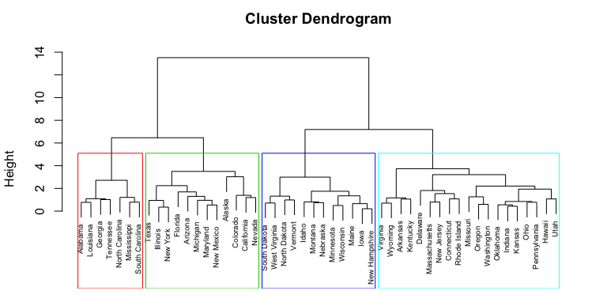

# Unsupervised learning {#unsupervised}

```{r ch5-setup, include=FALSE}

# Set the graphical theme
ggplot2::theme_set(ggplot2::theme_minimal())

# Set global knitr chunk options
knitr::opts_chunk$set(
  cache = TRUE,
  warning = FALSE, 
  message = FALSE, 
  collapse = TRUE, 
  fig.align = "center"
)
```


___Unsupervised learning___, includes a set of statistical tools to better understand *n* observations that contain a set of features ($x_1, x_2, \dots, x_p$) but do not contain a response variable (*Y*).  In essence, unsupervised learning is concerned with identifying groups in a data set. The groups may be defined by the rows (i.e., *clustering*) or the columns (i.e., *dimension reduction*); however, the motive in each case is quite different.  The goal of ___clustering___ is to segment observations into similar groups based on the observed variables. For example, to divide consumers into different homogeneous groups, a process known as market segmentation.  In dimension reduction, we are often concerned with reducing the number of variables in a data set. For example, classical regression models break down in the presence of highly correlated features. ___Principal components analysis___ is a technique that reduces the feature set to a potentially smaller set of uncorrelated variables. These variables are often used as the input variables to simpler modelling techniques like *multiple linear regression* (Section \@ref(multi-lm)).

```{r cluster-pca, echo=FALSE, fig.cap="Clustering identifies groupings among the observations (left). Dimension reduction identifies groupings among the features (right)."}
knitr::include_graphics("illustrations/clustering_vs_pca.jpeg")
```

Unsupervised learning is often performed as part of an exploratory data analysis. However, the exercise tends to be more subjective, and there is no simple goal for the analysis, such as prediction of a response. Furthermore, it can be hard to assess the quality of results obtained from unsupervised learning methods. The reason for this is simple. If we fit a predictive model using a supervised learning technique (i.e. linear regression), then it is possible to check our work by seeing how well our model predicts the response *Y* on observations not used in fitting the model. However, in unsupervised learning, there is no way to check our work because we don’t know the true answer—the problem is unsupervised.  

```{block, type="tip"}
Examples of how unsupervised methods can be used:

- A marketing firm can divide consumers into different homogeneous groups so that tailored marketing strategies can be developed and deployed for each segment.
- An online shopping site might try to identify groups of shoppers with similar browsing and purchase histories, as well as items that are of particular interest to the shoppers within each group. Then an individual shopper can be preferentially shown the items in which he or she is particularly likely to be interested, based on the purchase histories of similar shoppers. 
- A search engine might choose what search results to display to a particular individual based on the click histories of other individuals with similar search patterns. 
- A cancer researcher might assay gene expression levels in 100 patients with breast cancer. He or she might then look for subgroups among the breast cancer samples, or among the genes, in order to obtain a better understanding of the disease. 

```

These questions, and many more, can be addressed with unsupervised learning. This chapter covers the unsupervised learning techniques more commonly applied for clustering and dimension reduction purposes which includes:

1. Principal components analysis
2. K-means cluster analysis
3. Hierarchical cluster analysis
4. Alternative approaches for mixed data

## Prerequisites

For this section we will use the following packages:

```{r unsupervised-pkgs, message=FALSE}
library(tidyverse)  # data manipulation
library(cluster)    # clustering algorithms
library(factoextra) # clustering algorithms & visualization
```

To perform these unsupervised techniques in R, generally, the data should be prepared as follows:

1. Rows are observations (individuals) and columns are variables (also known as ___tidy___ per @wickham2014tidy).
2. Any missing values in the data must be removed or estimated.
3. Typically, the data must all be numeric values; however, in section ?? we discuss alternative approaches that can be applied to mixed (numeric and categorical) data.
4. Numeric data must be standardized (i.e. centered and scaled) to make variables comparable. Recall that, standardization consists of transforming the variables such that they have mean zero and standard deviation one.

We'll continue using the Ames housing data throughout this chapter; however, for the initial sections we'll only use the numeric variables.  Furthermore, we'll remove the sales price variable which results in 34 of the original variables.  What results are all numeric variables that describe various features of 2930 homes.  Our objective will be to identify various groupings among these variables and observations.

```{r unsupervised-data}
ames <- AmesHousing::make_ames() %>%
  select_if(is.numeric) %>%
  select(-Sale_Price)

dim(ames)

# remaining numeric variables describing homes
names(ames)
```

To prepare our data for these techniques, let's make sure our data complies with the 3 requirements mentioned above. Our data is already set up in the proper *tidy* fashion where each row is an individual observation and each column is an individual variable. And as you can see, there are no missing values in the data.  

```{r unsupervised-missing}
# how many missing values are in the data
sum(is.na(ames))
```

It is usually beneficial for each variable to be centered at zero due to the fact that it makes comparing each principal component to the mean or the dissimilarity distances for cluster analysis straightforward.  This also eliminates potential problems with magnitude differences of each variable. For example, the variance of `Year_Built` is 914, while the variance of `First_Flr_SF` is 1,535,789. The `Year_Built` variable isn't necessarily more variable, it's simply on a different scale relative to `First_Flr_SF`.  However, due to the math behind PCA and clustering algorithms, the larger magnitude variables will bias the results. 

```{block, type="note"}
However, keep in mind that there may be instances where scaling is not desirable. 
```


```{r pca-variance}
apply(ames[1:10], 2, var)
```

As we don’t want our unsupervised techniques to depend on an arbitrary variable unit, we start by standardizing the data using the R function `scale`. However, `scale` only works on variables coded as doubles; hence, we need to coerce any integer variables to double.

```{r unsupervised-scale}
ames_scale <- ames %>% 
  mutate_all(as.double) %>%
  scale()

# check that the mean value for each variable is centered at zero
# I only show the first 4 for brevity
summary(ames_scale)[, 1:4]
```

```{block2, type="note"}
PCA and clustering algorithms are influenced by the magnitude of each variable; therefore, the results obtained when we perform these algorithms will also depend on whether the variables have been individually scaled. 
```

## Principal Components Analysis {#pca}

Principal components analysis (PCA) ___reduces the dimensionality of the feature set___, allowing most of the variability to be explained using fewer variables than the original data set. Among our 34 numeric variables within the Ames data set, 16 variables have moderate correlation ( $\geq 0.30$) with at least one other variable. 

```{r unsupervised-correlation, echo=FALSE, fig.height=5, fig.cap="Top 10 variables containing the strongest correlation with at least one other variable."}
# compute unique variables with correlation > .6
m <- cor(ames_scale)

# plot top 10 variables with highest correlations
data.frame(
  row = rownames(m)[row(m)[upper.tri(m)]],
  col = colnames(m)[col(m)[upper.tri(m)]],
  corr = m[upper.tri(m)],
  stringsAsFactors = FALSE
  ) %>%
  filter(corr < 1 & corr > .3) %>%
  group_by(row) %>%
  top_n(1) %>%
  ungroup() %>%
  top_n(10) %>%
  ggplot(aes(reorder(row, corr), corr)) +
  geom_col() +
  coord_flip() +
  ylab("correlation coefficient") +
  xlab(NULL) 
```

Multicollinearity such as this can cause problems in some supervised models.  Moreover, often we want to simply explain common attributes of a data set in a lower dimensionality than the original data. Within the Ames data, total ground level square footage (`Gr_Liv_Area`) and total number of rooms above ground (`TotRms_AbvGrd`) have a correlation of `r round(cor(ames_scale[,20], ames_scale[,13]), 2)`. These two variables largely capture the same information - living space - of a house.  In fact, there are multiple variables in the Ames data that represent living space and are highly correlated.   Consequently, it can be useful to represent these highly correlated variables in a lower dimension such as "living space".

One option includes examining pairwise scatter plots for each variable against every other variable and identifying co-variation.  Unfortunately, this is tedious and becomes excessive quickly even with a small number of variables (given $p$ variables there are $p(p-1)/2$ scatterplot combinations. For example, since our Ames data has 35 numeric variables, we would need to examine $35(35-1)/2 = 595$ scatterplots! Clearly, a better method must exist to represent our data in a smaller dimension.

PCA provides a tool to do just this. It finds a low-dimensional representation of a data set that contains as much of the variation as possible. The idea is that each of the *n* observations lives in *p*-dimensional space, but not all of these dimensions are equally interesting. PCA seeks a small number of dimensions that are as interesting as possible, where the concept of *interesting* is measured by the amount that the observations vary along each dimension. Each of the dimensions found by PCA is a linear combination of the *p* features and we can take these linear combinations of the measurements and reduce the number of plots necessary for visual analysis while retaining most of the information present in the data. 

### Finding principal components

The *first principal component* of a data set $X_1$, $X_2$, ..., $X_p$ is the linear combination of the features

\begin{equation}
(\#eq:pca1)
Z_{1} = \phi_{11}X_{1} + \phi_{21}X_{2} + ... + \phi_{p1}X_{p},
\end{equation}

that has the largest variance and where $\phi_1$ is the first principal component loading vector, with elements $\phi_{12}, \phi_{22},\dots,\phi_{p2}$. The $\phi$ are *normalized*, which means that $\sum_{j=1}^{p}{\phi_{j1}^{2}} = 1$.  After the first principal component $Z_1$ of the features has been determined, we can find the second principal component $Z_2$. The second principal component is the linear combination of $X_1,\dots , X_p$ that has maximal variance out of all linear combinations that are __*uncorrelated*__ with $Z_1$. The second principal component scores $z_{12}, z_{22}, \dots, z_{n2}$ take the form

\begin{equation}
(\#eq:pca2)
Z_{2} = \phi_{12}X_{1} + \phi_{22}X_{2} + ... + \phi_{p2}X_{p}
\end{equation}

This proceeds until all principal components are computed.  The elements $\phi_{11}, ..., \phi_{p1}$ in Eq. 1 are the *loadings* of the first principal component. To calculate these loadings, we must find the $\phi$ vector that maximizes the variance. It can be shown using techniques from linear algebra that the eigenvector corresponding to the largest eigenvalue of the covariance matrix is the set of loadings that explains the greatest proportion of the variability.

An illustration provides a more intuitive grasp of principal components. Within our Ames housing data, first floor square footage and above ground square footage have a 0.56 correlation, we can explain the covariation of these variables in two dimensions (principal component 1 and principal component 2).  We see that the greatest co-variation falls along the first principal component, which is simply the line that minimizes the total squared distance from each point to its orthogonal projection onto the line. Consequently, we can explain the vast majority (93% to be exact) of variability among first floor square footage and above ground square footage simply with the first principal component.  

```{r create-pca-image, echo=FALSE, fig.width=6, fig.height=5, fig.cap="Principal components of two living area variables."}
df <- ames %>%
  select(var1 = First_Flr_SF, var2 = Gr_Liv_Area) %>%
  filter(var1 != var2) %>%
  mutate_all(log) %>%
  scale() %>% 
  data.frame() %>%
  filter(var1 < 4)

ggplot(df, aes(var1, var2)) +
  geom_jitter(alpha = .5, color = "dodgerblue") +
  geom_segment(
    aes(x = 0, xend = 1.5 , y = 0, yend = 1.5),
    arrow = arrow(length = unit(0.3,"cm")), size = 1.25, color = "black"
    ) +
  annotate("text", x = .5, y = .2, label = "First principal component", size = 5, hjust = 0) +
  annotate("text", x = -3.5, y = .8, label = "Second principal component", size = 5, hjust = 0) +
  geom_segment(
    aes(x = 0, xend = -0.25 , y = 0, yend = .5),
    arrow = arrow(length = unit(0.3,"cm")), size = 1.25, color = "black"
    ) +
  xlab("First floor square footage") +
  ylab("Above ground living area square footage") +
  theme_bw()
```

We can extend this to three variables, assessing the relationship between first floor square footage, above ground square footage, and total number of rooms above ground.  The first two principal component directions span the plane that best fits the data.  It minimizes the sum of squared distances from each point to the plan. As more dimension are added, these visuals are not as intuitive but we'll see shortly how we can use PCA to extract and visualize informative information.

```{r create-3D-pca-image, eval=FALSE, echo=FALSE}
df <- ames %>%
  select(var1 = First_Flr_SF, var2 = Gr_Liv_Area, var3 = TotRms_AbvGrd) %>%
  filter(var1 != var2) %>%
  mutate_at(vars(var1, var2), log)

library(pca3d)
pca <- prcomp(df, scale = FALSE)
pca3d(pca)
#snapshotPCA3d(file="3D-PCA.png")
```

```{r pca-3d-plot, echo=FALSE, fig.cap="Principal components of three living area variables variables."}
knitr::include_graphics("illustrations/3D-PCA.png")
```

### Performing PCA in R

R has several built-in functions (along with numerous add-on packages) that simplifies performing PCA.  One of these built-in functions is `prcomp`.  With `prcomp` we can perform PCA calculations quickly.  By default, the `prcomp` function centers the variables to have mean zero. By using the argument `scale = TRUE`, we can scale the variables to have standard deviation one; however, since we already standardized our data we'll remove this option.  The output from `prcomp` contains a number of items.

```{r pca-prcomp}
# perform PCA
pca_result <- prcomp(ames_scale, scale = FALSE)

# various output provided by the model
names(pca_result)
```

The *rotation* matrix provides the principal component loadings.  There are 35 distinct principal components for our data.  This is to be expected because you can have the same number of components as you have variables.  However, shortly I'll show you how to understand how much each component explains our data.

As for the principal component loadings - remember, the loadings represent $\phi_{12}, \phi_{22},\dots,\phi_{p2}$ in Equation \@ref(eq:eq:pca1).  Thus, these loadings represent coefficients in which it illustrates each variables ___influence___ on the principal component.  By default, loadings (aka eigenvectors) in R point in the *negative* direction. For this example, we’d prefer them to point in the positive direction because it leads to more logical insights. To use the positive-pointing vector, we multiply the default loadings by -1.

```{r pca-loadings}
# convert loadings to positive
pca_result$rotation <- -pca_result$rotation

# look at the first 5 principal component loadings and the first 5 rows
pca_result$rotation[1:5, 1:5]
```

We can visualize the level of contribution (relative size of the loadings) each variable has on principal components 1 (left) and 2 (right). From the results below we can see that the first principal component (PC1) roughly corresponds to the main living space and the garage. The second component (PC2) is also affected by living space but appears to consist of several secondary living areas (i.e. second floor, basement). 

```{r pca-contribution-plot, fig.width=12, fig.height=4, fig.cap="Level of contribution each variable has on principal components 1 (left) and 2 (right)."}
p1 <- fviz_contrib(pca_result, choice = "var", axes = 1)
p2 <- fviz_contrib(pca_result, choice = "var", axes = 2)

gridExtra::grid.arrange(p1, p2, nrow = 1)
```

We can also obtain the principal components *scores* from our results as these are stored in the *x* list item of our results. However, we also want to make a sign adjustment to our scores to point them in the positive direction. 

```{r pca-scores-adj}
# sign adjustment
pca_result$x <- -pca_result$x

# look at scores for the first five observations for PC1 and PC2
pca_result$x[1:5, 1:2]
```

The principal components *scores* simply places a standardized score for each observation for each principal component.  Thus, above we see that the first observation has a score of 1.18 for PC1. This just states that based on this houses attributes (at least for the numeric variables we are assessing), this house is about 1 standard deviation above the average value for PC1 across all the homes.  Since PC1 appears to represent *main living space* and *garage space* it appears that this house is about 1 standard deviation more than the average of these attributes compared to all other homes.

```{block2, type="note"}
We can also visualize the contribution of each observation on a particular PC with `fviz_contrib` by changing `choice = "ind"`.  This basically takes the absoluate values of the *scores* and plots the percent of total *scores* for each state.  However, this is only useful when we are dealing with a small amount of observations (50 or less). 
```

### Selecting the Number of Principal Components

So far we have computed principal component attributes and gained a little understanding of what the results initially tell us.  However, a primary goal is to use PCA for data reduction.  In essence, we want to come out of PCA with less components than variables and with these components telling us as much variation as possible about our data.  But how do we decide how many principal components to keep? Do we keep the first four principal components or the first 16?  

There are three primary approaches in helping to make this decision:

1. Eigenvalue criterion
2. Proportion of variance explained criterion
3. Scree plot criterion

#### Eigenvalue criterion

The sum of the eigenvalues is equal to the number of variables entered into the PCA; however, the eigenvalues will range from greater than one to near zero. An eigenvalue of 1 means that the principal component would explain about one variable's worth of the variability. The rationale for using the eigenvalue criterion is that each component should explain at least one variable's worth of the variability, and therefore, the eigenvalue criterion states that only components with eigenvalues greater than 1 should be retained. 

`prcomp` automatically computes the standard deviations of the principal components, which is equal to the square roots of the eigenvalues, and stores these values in the `pca_result$sdev` list item.  Therefore, we can compute the eigenvalues easily and identify principal components where the sum of eigenvalues is greater than or equal to 1.  Consequently, using this criteria would have us retain the first 11 principal components.

```{r eigen-criterion}
# compute eigenvalues
eigen <- pca_result$sdev^2

# sum of all eigenvalues equals number of variables
sum(eigen)

# find all PCs where the sum of eigenvalues is greater than or equal to 1
which(eigen >= 1)
```

```{r eigen-criterion-plot, echo=FALSE, fig.cap="Eigenvalue criterion keeps all principal components where the sum of the eigenvalues are above or equal to a value of one.", fig.height=3.5, fig.width=6}
data.frame(
  PC = seq_along(eigen),
  Eigenvalue = eigen
) %>%
  ggplot(aes(PC, Eigenvalue)) +
  geom_point() +
  geom_hline(yintercept = 1, lty = "dashed", color = "red") +
  scale_y_continuous(breaks = 0:6) +
  annotate("text", x = 15, y = 1, label = "eigenvalue criteria cutoff", color = "red", size = 5, hjust = 0, vjust = -1) + 
  theme_bw()
```


#### Proportion of variance explained criterion

The *proportion of variance explained* (PVE) provides us a technical way to identify the optimal number of principal components to keep based on the total variability that we would like to account for. Mathematically, the PVE for the *m*th principal component is calculated as:

$$PVE = \frac{{\sum_{i=1}^{n}(\sum_{j=1}^{p}{\phi_{jm}x_{ij}})^{2}}}{\sum_{j=1}^{p}\sum_{i=1}^{n}{x_{ij}^{2}}} \tag{3}$$

It can be shown that the PVE of the *m*th principal component can be more simply calculated by taking the *m*th eigenvalue and dividing it by the number of principal components (or, equivalently, the sum of the eigenvalues). We can create a vector of PVEs for each principal component:

```{r}
# compute the PVE of each principal component
PVE <- eigen / sum(eigen)

round(PVE, 2)
```

The first principal component in our example therefore explains `r round(100*PVE[1], 0)`% of the variability, and the second principal component explains `r round(100*PVE[2], 0)`%. Together, the first two principal components explain `r round(100*sum(PVE[1:2])/sum(PVE), 0)`% of the variability.

Thus, if an analyst desires to choose the number of principal components that explains at least 75% of the variability in our original data then they would choose the first 16 components.

```{r}
# how many PCs required to explain at least 75% of total variability
min(which(cumsum(PVE) >= .75))
```

```{r pve-criterion-plot, echo=FALSE, fig.cap="PVE criterion keeps all principal components that are above or equal to a pre-specified threshold of total variability explained.", fig.height=3.5, fig.width=6}
data.frame(
  PC = seq_along(eigen),
  PVE = cumsum(PVE)
) %>%
  ggplot(aes(PC, PVE)) +
  geom_point() +
  geom_hline(yintercept = .75, lty = "dashed", color = "red") +
  scale_y_continuous(breaks = seq(0, 1, by = .25), labels = scales::percent) +
  annotate("text", x = 18, y = .75, label = "75% variability explained cutoff", color = "red", size = 4, hjust = 0, vjust = 1.25) + 
  theme_bw()
```

What amount of variability is reasonable?  This varies from the problem being addressed and the data being used.  However, when the principal components are being used for descriptive purposes only, such as customer profiling, then the proportion of variability explained may be lower than otherwise.  When the principal components are to be used as replacements for the original variables, and used for further inference in models downstream, then the PVE should be as much as can conveniently be achieved, given any constraints.

#### Scree plot criterion

A scree plot shows the eigenvalues or PVE for each individual principal component.  Most scree plots look broadly similiar in shape, starting high on the left, falling rather quickly, and then flattening out at some point.  This is because the first component usually explains much of the variability, the next few components explain a moderate amount, and the latter components only explain a small amount of the variability.  The scree plot criterion selects all components just before the line flattens out, which is four in our example.

```{r pca-scree-plot-criterion, fig.cap="Scree plot criterion keeps all principal components before the line flattens out.", fig.height=3.5, fig.width=6}
fviz_screeplot(pca_result, ncp = 34)
```


So how many principal components should we use in this example?  The frank answer is that there is no single method for determining how many components to use. In this case, differing criteria suggest to retain 4, 11, and 16 (based on a 75% requirement) components.  The number you go with depends on your end objective and analytic workflow.  If I were merely trying to profile houses I would probably use 4, if I were performing dimension reduction to feed into a downstream predictive model I would likely retain 11 or 16.


### Extracting additional insights

As previously identified, 27% of the variation in our data can be captured in the first two components:

1. PC1 roughly corresponds to the main living space and the garage.
2. PC2 is also affected by living space but appears to consist of several secondary living areas (i.e. second floor, basement).

We can visualize this further with the following multivariate plot. This plot provides the directional influence each variable has on the principal components. The center point represents no influence on PC1 (x-axis) or PC2 (y-axis). Variables that are darker and further to the right of the center vertical line have a strong position influence on PC1 (i.e. `Gr_Liv_Area`, `TotRms_Abv_Grd`). Like-wise, variables that are lighter and closer to the center horizontal line have a small influence on PC2 (i.e. `Longitude`, `Porch_SF`). 

```{r pca-var-contribution, fig.cap="Variable contributions to the first and second principal components."}
fviz_pca_var(pca_result, alpha.var = "contrib")
```

```{block2, type="note"}
Check out the `axes` argument (`?fviz_pca_var`) to compare different principal components in a pairwise fashion.
```

Furthermore, we can see where each observation aligns along these components.  This allows us to identify observations that have high values for one or more attributes that influence PC1 and PC2.  For example, observations 2181 and 1499 likely have higher values for main living space and garage attributes.  Whereas observation 2195 likely has lower values of secondary living space (likely a single story home or does not have a basement).

```{r pca-ind-contribution, fig.cap="Individual household observations along the first and second principal components."}
fviz_pca_ind(pca_result, alpha.ind = .3)
```

### PCA with mixed data

Typical textbook examples of PCA include only numeric data as demonstrated above.  However, most real life data sets contain a mixture of numeric and categorical variables. The original Ames housing data set contains 35 numeric variables and 46 categorical variables.  Consequently, only focusing on the numeric variables required us to remove over half of our features.  Rather, than remove this (likely important) information, we can retain it and still perform PCA.  However, the approach we apply differs depending on if we are merely seeking inference on housing attributes or if we plan to use the PCA output for downstream modeling.


#### PCA for inference

When performing data mining where the principal components are being used for descriptive purposes only, such as customer profiling, we can convert our categorical variables to numeric information. First, any ordinal variables can be numerically coded in an ordinal fashion.  For example, the `Overall_Qual` variable measures the overall quality of a home across 10 levels (very poor to very excellent). We can recode these variables numerically from 1-10 which now puts them on a continuous dimension.

Nominal categorical variables; however, do not contain any natural ordering.  One alternative is to one-hot encode these variables to convert them to binary 0/1 values.  This significantly expands the number of variables in our data set.  


```{r pca-prep-one-hot}
# full ames data set --> recode ordinal variables to numeric
ames_full <- AmesHousing::make_ames() %>%
  mutate_if(str_detect(names(.), "Qual|Cond|QC|Qu"), as.numeric)

# one-hot encode --> retain only the features and not sale price
full_rank  <- caret::dummyVars(Sale_Price ~ ., data = ames_full, fullRank = TRUE)
ames_1hot <- predict(full_rank, ames_full)

# new dimensions
dim(ames_1hot)
```

Now that all our variables are represented numerically, we can perform PCA as we did in the previous sections.  Using the scree plot criterion suggests to retain eight principal components, which explains 50% of the variability across all 240 variables.


```{r pca-apply-one-hot, fig.cap="Scree plot showing the amount of variance explained for each of the first 20 principal components."}
# apply PCA to one-hot encoded data
pca_one_hot <- prcomp(ames_1hot, scale = TRUE)

# sign adjustment to loadings and scores
pca_one_hot$rotation <- -pca_one_hot$rotation
pca_one_hot$x <- -pca_one_hot$x

# scree plot
fviz_screeplot(pca_result, ncp = 20)
```

#### PCA for downstream modeling

When the principal components are to be used as replacements for the original variables, and used for further inference in models downstream, then we want to be a little more particular about how we change the data.  Many models (i.e. tree-based) perform quite well when the categorical variables are untransformed.  Consequently, often our motives to perform PCA is to reduce the dimension of numerical variables and minimize multicollinearity so that we can apply models that are sensitive to multicollinearity (i.e. linear regression models, neural networks).  

The `caret` package provides a function that allows you to perform many preprocessing steps to a set of features.  In the following example, I center, scale, and apply PCA to the Ames data.  The output of `preProcess` lists the number of variables centered, scaled, and PCA applied to (34 variables).  These represent the 34 numeric variables.  It also states that 46 categorical variables were ignored since these preprocessing steps cannot be applied to non-numeric variables.  Lastly, it states that 26 principal components were retained to capture the variability explained threshold specified (95%). 

```{r pca-mixed-data-preprocessing}
# get feature set
ames_full <- AmesHousing::make_ames()
features <- subset(ames_full, select = -Sale_Price)

# preprocess data
preprocess <- caret::preProcess(
  x = features,
  method = c("center", "scale", "pca"),
  thresh = 0.95
)

preprocess
```

```{block2, type="note"}
You can adjust the `thresh` argument or also use `numComp` to explicitly specify the number of varibales to retain.
```


Next, we apply the `preProcess` object to the training data to return a transformed feature set with the specified preprocessing steps.  This new `transformed_features` data frame contains the original 46 categorical variables and the 26 principal components retained (72 total variables). This preprocessed data can now be fed into any future models, which you will learn about in the predictive analytics section.  

```{r}
# create transformed feature set
transformed_features <- predict(preprocess, features)
dim(transformed_features)
```

## Cluster Analysis

Clustering is a broad set of techniques for ___finding subgroups of observations___ within a data set. When we cluster observations, we want observations in the same group to be similar and observations in different groups to be dissimilar. Because there isn’t a response variable, this is an unsupervised method, which implies that it seeks to find relationships between the *n* observations without being trained by a response variable. Clustering allows us to identify which observations are alike, and potentially categorize them therein. Within the cluster analysis domain, there are several clustering techniques we can apply - we will focus on the more common applications.


### Clustering distance measures

The classification of observations into groups requires some methods for computing the distance of the (dis)similarity between each pair of observations. The result of this computation is known as a dissimilarity or distance matrix. 

There are many methods to calculate this distance information; the choice of distance measures is a critical step in clustering. It defines how the similarity of two elements (x, y) is calculated and it will influence the shape of the clusters.

The classical methods for distance measures are *Euclidean* and *Manhattan distances*, which are defined as follow:

__Euclidean distance:__

$$ d_{euc}(x,y) = \sqrt{\sum^n_{i=1}(x_i - y_i)^2} \tag{1}$$

__Manhattan distance:__

$$ d_{man}(x,y) = \sum^n_{i=1}|(x_i - y_i)| \tag{2}$$

Where, *x* and *y* are two vectors of length *n*.

Other dissimilarity measures exist such as correlation-based distances, which is widely used for gene expression data analyses. Correlation-based distance is defined by subtracting the correlation coefficient from 1. Different types of correlation methods can be used such as:

__Pearson correlation distance:__

$$d_{cor}(x, y) = 1 - \frac{\sum^n_{i=1}(x_i-\bar x)(y_i - \bar y)}{\sqrt{\sum^n_{i=1}(x_i-\bar x)^2\sum^n_{i=1}(y_i - \bar y)^2}} \tag{3}$$

__Spearman correlation distance:__

The spearman correlation method computes the correlation between the rank of *x* and the rank of *y* variables.

$$d_{spear}(x, y) = 1 - \frac{\sum^n_{i=1}(x^\prime_i-\bar x^\prime)(y^\prime_i - \bar y^\prime)}{\sqrt{\sum^n_{i=1}(x^\prime_i-\bar x^\prime)^2\sum^n_{i=1}(y^\prime_i - \bar y^\prime)^2}} \tag{4}$$

Where $x^\prime_i = rank(x_i)$ and $y^\prime_i = rank(y_i)$.

__Kendall correlation distance:__

Kendall correlation method measures the correspondence between the ranking of *x* and *y* variables. The total number of possible pairings of *x* with *y* observations is *n(n − 1)/2*, where *n* is the size of *x* and *y*. Begin by ordering the pairs by the *x* values. If *x* and *y* are correlated, then they would have the same relative rank orders. Now,
for each $y_i$, count the number of $y_j > y_i$ (concordant pairs (c)) and the number of $y_j < y_i$ (discordant pairs (d)).

Kendall correlation distance is defined as follow:

$$d_{kend}(x,y) = 1 - \frac{n_c - n_d}{\frac{1}{2}n(n - 1)} \tag{5}$$

The choice of distance measures is very important, as it has a strong influence on the clustering results. For most common clustering software, the default distance measure is the Euclidean distance.  However, depending on the type of the data and the research questions, other dissimilarity measures might be preferred and you should be aware of the options.

Within R it is simple to compute and visualize the distance matrix using the functions `get_dist` and `fviz_dist` from the `factoextra` R package.  The following figure plots the Euclidean distances between the first 50 homes.  This starts to illustrate which observations have large dissimilarities (red) versus those that appear to be fairly similar (blue).

- `get_dist`: for computing a distance matrix between the rows of a data matrix. The default distance computed is the Euclidean; however, `get_dist` also supports distanced described in equations 2-5 above plus others.
- `fviz_dist`: for visualizing a distance matrix

```{r distance, fig.align='center', fig.width=10, fig.height=7, fig.cap="Distance matrix plot for first 50 observations."}
# we continue using our scaled ames data set
distance <- get_dist(ames_scale[1:50, ], method = "euclidean")
fviz_dist(
  distance,
  gradient = list(low = "blue", mid = "white", high = "red")
  )
```

```{block2, type="tip"}
Check out the different distance measures that `get_dist` accepts with `?get_dist`. Use `method = "pearson"` and see how the distance matrix visualization changes.
```


### K-means clustering

K-means clustering is the most commonly used clustering algorithm for partitioning observations into a set of *k* groups (i.e. *k* clusters), where *k* represents the number of groups pre-specified by the analyst. It classifies objects in multiple groups (i.e., clusters), such that objects within the same cluster are as similar as possible (i.e., high intra-class similarity), whereas objects from different clusters are as dissimilar as possible (i.e., low inter-class similarity). In k-means clustering, each cluster is represented by its center (i.e, centroid) which corresponds to the mean of points assigned to the cluster.

#### Defining clusters

The basic idea behind k-means clustering consists of defining clusters so that the total intra-cluster variation (known as total within-cluster variation) is minimized. There are several k-means algorithms available. The standard algorithm is the
Hartigan-Wong algorithm (1979), which defines the total within-cluster variation as the sum of squared distances Euclidean distances between items and the corresponding centroid:

$$W(C_k) = \sum_{x_i \in C_k}(x_i - \mu_k)^2 \tag{6}$$

where:

- $x_i$ is a data point belonging to the cluster $C_k$
- $\mu_k$ is the mean value of the points assigned to the cluster $C_k$

Each observation ($x_i$) is assigned to a given cluster such that the sum of squares (SS) distance of the observation to their assigned cluster centers ($\mu_k$) is minimized.

We define the total within-cluster variation as follows:

$$tot.withiness = \sum^k_{k=1}W(C_k) = \sum^k_{k=1}\sum_{x_i \in C_k}(x_i - \mu_k)^2 \tag{7} $$

The *total within-cluster sum of square* measures the compactness (i.e goodness) of the clustering and we want it to be as small as possible.

#### K-means algorithm

The first step when using k-means clustering is to indicate the number of clusters (k) that will be generated in the final solution.  The algorithm starts by randomly selecting k objects from the data set to serve as the initial centers for the clusters. The selected objects are also known as cluster means or centroids. Next, each of the remaining objects is assigned to it’s closest centroid, where closest is defined using the Euclidean distance between the object and the cluster
mean. This step is called “cluster assignment step”. After the assignment step, the algorithm computes the new mean value of each cluster. The term cluster “centroid update” is used to design this step. Now that the centers have been recalculated, every observation is checked again to see if it might be closer to a different cluster. All the objects are reassigned again using the updated cluster means.  The cluster assignment and centroid update steps are iteratively repeated until the
cluster assignments stop changing (i.e until *convergence* is achieved). That is, the clusters formed in the current iteration are the same as those obtained in the previous iteration.

K-means algorithm can be summarized as follows:

1. Specify the number of clusters (K) to be created (by the analyst)
2. Select randomly k objects from the data set as the initial cluster centers or means
3. Assigns each observation to their closest centroid, based on the Euclidean distance between the object and the centroid
4. For each of the k clusters update the cluster centroid by calculating the new mean values of all the data points in the cluster. The centroid of a Kth cluster is a vector of length *p* containing the means of all variables for the observations
in the kth cluster; *p* is the number of variables.
5. Iteratively minimize the total within sum of square. That is, iterate steps 3 and 4 until the cluster assignments stop changing or the maximum number of iterations is reached. By default, the R software uses 10 as the default value
for the maximum number of iterations.

#### Computing k-means clustering in R

We can compute k-means in R with the `kmeans` function. Here will group the data into two clusters (`centers = 2`). The `kmeans` function also has an `nstart` option that attempts multiple initial configurations and reports on the best one. For example, adding `nstart = 25` will generate 25 initial configurations. This approach is often recommended. 

```{r kmeans1}
k2 <- kmeans(ames_scale, centers = 2, nstart = 25)
```

The output of `kmeans` is a list with several bits of information.  The most important being:

- `cluster`: A vector of integers (from 1:k) indicating the cluster to which each point is allocated.
- `centers`: A matrix of cluster centers.
- `totss`: The total sum of squares.
- `withinss`: Vector of within-cluster sum of squares, one component per cluster.
- `tot.withinss`: Total within-cluster sum of squares, i.e. sum(withinss).
- `betweenss`: The between-cluster sum of squares, i.e. $totss-tot.withinss$.
- `size`: The number of points in each cluster.

If we print the results we'll see that our groupings resulted in 2 cluster sizes of `r k2$size[1]` and `r k2$size[2]`.  We can also extract the cluster centers for each variable and the cluster assignment for each observation.  

```{r kmeans-structure}
str(k2)
```

We can also view our results by using `fviz_cluster`.  This provides a nice illustration of the clusters.  If there are more than two dimensions (variables) `fviz_cluster` will perform principal component analysis (PCA) and plot the data points according to the first two principal components that explain the largest amount of variance.  So this chart shows that our observations are being clustered primarily based on having above or below average values of dimension 2 (recall from the PCA section that the second principal component - or x axis - largely represented *secondary living spaces*).  

```{r k2-viz, fig.align='center'}
fviz_cluster(k2, data = ames_scale, geom = "point", alpha = .4)
```

```{block2, type="tip"}
You can also visualize clusters against specific variables by assigning `choose.vars` within `fviz_cluster`.
```

Because the number of clusters (k) must be set before we start the algorithm, it is often advantageous to use several different values of k and examine the differences in the results. We can execute the same process for 3, 4, and 5 clusters, and the results are shown in the figure:

```{r kmeans-which-k}
k3 <- kmeans(ames_scale, centers = 3, nstart = 25)
k4 <- kmeans(ames_scale, centers = 4, nstart = 25)
k5 <- kmeans(ames_scale, centers = 5, nstart = 25)

# plots to compare
p1 <- fviz_cluster(k2, geom = "point", data = ames_scale, alpha = .4) + ggtitle("k = 2")
p2 <- fviz_cluster(k3, geom = "point",  data = ames_scale, alpha = .4) + ggtitle("k = 3")
p3 <- fviz_cluster(k4, geom = "point",  data = ames_scale, alpha = .4) + ggtitle("k = 4")
p4 <- fviz_cluster(k5, geom = "point",  data = ames_scale, alpha = .4) + ggtitle("k = 5")

library(gridExtra)
grid.arrange(p1, p2, p3, p4, nrow = 2)
```


Although visually assessing the different k cluster outputs tells us where true dilineations occur (or do not occur) between clusters, it does not tell us what the optimal number of clusters is.

#### Determining optimal clusters

As you may recall the analyst specifies the number of clusters to use; preferably the analyst would like to use the optimal number of clusters. To aid the analyst, the following explains the three most popular methods for determining the optimal clusters, which includes:

* Elbow method
* Silhouette method
* Gap statistic

##### Elbow method {#elbow}

Recall that, the basic idea behind cluster partitioning methods, such as k-means clustering, is to define clusters such that the total within-cluster variation is minimized:

$$ minimize\Bigg(\sum^k_{k=1}W(C_k)\Bigg) \tag{8}$$

where $C_k$ is the $k^{th}$ cluster and $W(C_k)$ is the within-cluster variation. The total within-cluster sum of square (wss) measures the compactness of the clustering and we want it to be as small as possible.  Thus, we can use the following algorithm to define the optimal clusters:

1. Compute clustering algorithm (e.g., k-means clustering) for different values of *k*. For instance, by varying *k* from 1 to 20 clusters.
2. For each *k*, calculate the total within-cluster sum of square (wss).
3. Plot the curve of wss according to the number of clusters *k*.
4. The location of a bend (knee) in the plot is generally considered as an indicator of the appropriate number of clusters.

Fortunately, this process to compute the "Elbow method" has been wrapped up in a single function (`fviz_nbclust`). Unfortunately, the results are unclear where the elbow actually is?  Do we select 3 clusters? 7 clusters? 18?

```{r kmeans-elbow-method2, fig.width=7, fig.height=4}
set.seed(123)

fviz_nbclust(ames_scale, kmeans, method = "wss", k.max = 20)
```

##### Average silhouette method {#silo}

In short, the average silhouette approach measures the quality of a clustering. That is, it determines how well each object lies within its cluster. A high average silhouette width indicates a good clustering. The average silhouette method computes the average silhouette of observations for different values of *k*. The optimal number of clusters *k* is the one that maximizes the average silhouette over a range of possible values for *k*.[^kauf]  

Similar to the elbow method, this process to compute the "average silhoutte method" has been wrapped up in a single function (`fviz_nbclust`):

```{r kmeans-silhouette, fig.width=7, fig.height=4}
set.seed(123)

fviz_nbclust(ames_scale, kmeans, method = "silhouette", k.max = 20)
```

#### Gap statistic method {#gap}

The gap statistic has been published by [R. Tibshirani, G. Walther, and T. Hastie (Standford University, 2001)](http://web.stanford.edu/~hastie/Papers/gap.pdf). The approach can be applied to any clustering method (i.e. K-means clustering, hierarchical clustering).  The gap statistic compares the total intracluster variation for different values of *k* with their expected values under null reference distribution of the data (i.e. a distribution with no obvious clustering).  The reference dataset is generated using Monte Carlo simulations of the sampling process. That is, for each variable ($x_i$) in the data set we compute its range $[min(x_i), max(x_j)]$ and generate values for the n points uniformly from the interval min to max.

For the observed data and the the reference data, the total intracluster variation is computed using different values of *k*. The *gap statistic* for a given *k* is defined as follow:

$$ Gap_n(k) = E^*_n{log(W_k)} - log(W_k) \tag{9}$$

Where $E^*_n$ denotes the expectation under a sample size *n* from the reference distribution. $E^*_n$ is defined via bootstrapping (B) by generating B copies of the reference datasets and, by computing the average $log(W^*_k)$.  The gap statistic measures the deviation of the observed $W_k$ value from its expected value under the null hypothesis.  The estimate of the optimal clusters ($\hat k$) will be the value that maximizes $Gap_n(k)$. This means that the clustering structure is far away from the uniform distribution of points.

In short, the algorithm involves the following steps:

1. Cluster the observed data, varying the number of clusters from $k=1, \dots, k_{max}$, and compute the corresponding $W_k$.
2. Generate B reference data sets and cluster each of them with varying number of clusters $k=1, \dots, k_{max}$. Compute the estimated gap statistics presented in eq. 9.
3. Let $\bar w = (1/B) \sum_b log(W^*_{kb})$, compute the standard deviation $sd(k) = \sqrt{(1/b)\sum_b(log(W^*_{kb})- \bar w)^2}$ and define $s_k = sd_k \times \sqrt{1 + 1/B}$.
4. Choose the number of clusters as the smallest k such that $Gap(k) \geq Gap(k+1) - s_{k+1}$.

We can visualize the results with `fviz_gap_stat` which suggests four clusters as the optimal number of clusters.

```{r kmeans-gap, fig.width=7, fig.height=4}
set.seed(123)

fviz_nbclust(ames_scale, kmeans, method = "gap_stat", k.max = 20, verbose = FALSE)
```


```{block2, type="comment"}
It is often the case, as above, where each metric suggests a different number of preferred clusters. This is part of the challege of clustering and, often, the decision about the number of clusters is partly driven by qualitative assessment and domain knowledge. 
```

In addition to these commonly used approaches, the `NbClust` package, published by [Charrad et al., 2014](http://www.jstatsoft.org/v61/i06/paper), provides 30 indices for determining the relevant number of clusters and proposes to users the best clustering scheme from the different results obtained by varying all combinations of number of clusters, distance measures, and clustering methods.


#### Extracting results

Once you've identified the preferred number of clusters, we rerun the analysis with the selected *k* (8 in this example).  We can extract the clusters and add to our initial data to do some descriptive statistics at the cluster level.  Here, we can see that homes assigned to cluster 2 tend to be older, one story homes (or with a minimal second floor) whereas homes in cluster 7 tend to be newer (relatively speaking), two story homes with lots of space.

```{r}
# re-run kmeans
set.seed(123)
final <- kmeans(ames_scale, 8, nstart = 25)

# perform descriptive analysis at the cluster level
ames %>%
  mutate(Cluster = final$cluster) %>%
  group_by(Cluster) %>%
  summarise_at(vars(Year_Built, Second_Flr_SF, TotRms_AbvGrd, Garage_Area), "mean")
```


#### Additional comments

K-means clustering is a very simple and fast algorithm. Furthermore, it can efficiently deal with very large data sets. However, there are some weaknesses of the k-means approach.

One potential disadvantage of K-means clustering is that it requires us to pre-specify the number of clusters. Hierarchical clustering is an alternative approach which does not require that we commit to a particular choice of clusters. Hierarchical clustering has an added advantage over K-means clustering in that it results in an attractive tree-based representation of the observations, called a dendrogram. An additional disadvantage of K-means is that it’s sensitive to outliers and different results can occur if you change the ordering of your data. The Partitioning Around Medoids (PAM) clustering approach is less sensititive to outliers and provides a robust alternative to k-means to deal with these situations.  The next two sections illustrate these clustering approaches.


### Hierarchical clustering

Hierarchical clustering is an alternative approach to k-means clustering for identifying groups in the dataset. It does not require us to pre-specify the number of clusters to be generated as is required by the k-means approach. Furthermore, hierarchical clustering has an added advantage over K-means clustering in that it results in an attractive tree-based representation of the observations, called a dendrogram.

```{r dendrogram, echo=FALSE, fig.cap="Illustrative dendrogram."}

```

#### Hierarchical Clustering Algorithms

Hierarchical clustering can be divided into two main types: *agglomerative* and *divisive*.

1. __Agglomerative clustering:__ Also known as AGNES (Agglomerative Nesting). It works in a bottom-up manner. That is, each object is initially considered as a single-element cluster (leaf). At each step of the algorithm, the two clusters that are the most similar are combined into a new bigger cluster (nodes). This procedure is iterated until all points are a member of just one single big cluster (root) (see figure below). The result is a tree which can be plotted as a dendrogram.
2. __Divisive hierarchical clustering:__ It’s also known as DIANA (Divise Analysis) and it works in a top-down manner. The algorithm is an inverse order of AGNES. It begins with the root, in which all objects are included in a single cluster. At each step of iteration, the most heterogeneous cluster is divided into two. The process is iterated until all objects are in their own cluster (see figure below).

```{block2, type="tip"}
Note that agglomerative clustering is good at identifying small clusters. Divisive hierarchical clustering is good at identifying large clusters.
```

```{r dendrogram2, echo=FALSE, fig.cap="AGNES (bottom-up) versus DIANA (top-down) clustering."}
knitr::include_graphics("illustrations/dendrogram2.png")
```

As we learned in the last section, we measure the (dis)similarity of observations using distance measures (i.e. Euclidean distance, Manhattan distance, etc.) In R, the Euclidean distance is used by default to measure the dissimilarity between each pair of observations. 

However, a bigger question is: *How do we measure the dissimilarity between two clusters of observations?* A number of different cluster agglomeration methods (i.e, linkage methods) have been developed to answer to this question. The most common types methods are:

- __Maximum or complete linkage clustering:__ It computes all pairwise dissimilarities between the elements in cluster 1 and the elements in cluster 2, and considers the largest value (i.e., maximum value) of these dissimilarities as the distance between the two clusters. It tends to produce more compact clusters.
- __Minimum or single linkage clustering:__ It computes all pairwise dissimilarities between the elements in cluster 1 and the elements in cluster 2, and considers the smallest of these dissimilarities as a linkage criterion. It tends to produce long, “loose” clusters.
- __Mean or average linkage clustering:__ It computes all pairwise dissimilarities between the elements in cluster 1 and the elements in cluster 2, and considers the average of these dissimilarities as the distance between the two clusters.
- __Centroid linkage clustering:__ It computes the dissimilarity between the centroid for cluster 1 (a mean vector of length p variables) and the centroid for cluster 2.
- __Ward’s minimum variance method:__ It minimizes the total within-cluster variance. At each step the pair of clusters with minimum between-cluster distance are merged.

We can see the differences these approaches in the following dendrograms:

```{r dendrogram3, echo=FALSE, fig.cap="Differing hierarchical clustering outputs based on similarity measures."}
knitr::include_graphics("illustrations/dendrogram3.png")
```

```{block2, type="comment"}
The important thing to remember is there are multiple ways to define clusters when performing hierarchical cluster analysis. 
```

#### Hierarchical Clustering with R 

There are different functions available in R for computing hierarchical clustering. The commonly used functions are:

- `hclust` [in stats package] and `agnes` [in cluster package] for agglomerative hierarchical clustering (HC)
- `diana` [in cluster package] for divisive HC

##### Agglomerative Hierarchical Clustering

We can perform agglomerative HC with `hclust`.  First we compute the dissimilarity values with `dist` and then feed these values into `hclust` and specify the agglomeration method to be used (i.e. "complete", "average", "single", "ward.D").  

```{r agglomerative1}
# for reproducibility
set.seed(123)

# Dissimilarity matrix
d <- dist(ames_scale, method = "euclidean")

# Hierarchical clustering using Complete Linkage
hc1 <- hclust(d, method = "complete" )
```

```{block2, type="tip"}
 You could plot the dendrogram with `plot(hc1, cex = 0.6, hang = -1)`; however, due to the number of observations the output is not discernable. 
```

Alternatively, we can use the `agnes` function.  This function behaves similar to `hclust`; however, with the `agnes` function you can also get the agglomerative coefficient, which measures the amount of clustering structure found (values closer to 1 suggest strong clustering structure).

```{r agglomerative2}
# for reproducibility
set.seed(123)

# Compute maximum or "complete linkage clustering with agnes
hc2 <- agnes(ames_scale, method = "complete")

# Agglomerative coefficient
hc2$ac
```

This allows us to find certain hierarchical clustering methods that can identify stronger clustering structures. Here we see that Ward’s method identifies the strongest clustering structure of the four methods assessed.

```{r agglomerative-compare}
# methods to assess
m <- c( "average", "single", "complete", "ward")
names(m) <- c( "average", "single", "complete", "ward")

# function to compute coefficient
ac <- function(x) {
  agnes(ames_scale, method = x)$ac
}

# get agglomerative coefficient for each linkage method
map_dbl(m, ac)
```

##### Divisive Hierarchical Clustering

The R function `diana` provided by the cluster package allows us to perform divisive hierarchical clustering. `diana` works similar to `agnes`; however, there is no method to provide. As before, a divisive coefficient closer to one suggests stronger group distinctions.  Consequently, it appears that an agglomerative approach with Ward's linkage provides the optimal results.

```{r divisive}
# compute divisive hierarchical clustering
hc4 <- diana(ames_scale)

# Divise coefficient; amount of clustering structure found
hc4$dc
```

#### Determining optimal clusters

Similar to how we determined optimal clusters with k-means clustering, we can execute similar approaches for hierarchical clustering:

```{r hclust-optimal-clusters-compare, fig.width=12, fig.height=3.5}
hc_ward <- hclust(d, method = "ward.D2" )

p1 <- fviz_nbclust(ames_scale, FUN = hcut, method = "wss", k.max = 10)
p2 <- fviz_nbclust(ames_scale, FUN = hcut, method = "silhouette", k.max = 10)

gap_stat <- clusGap(ames_scale, FUN = hcut, nstart = 25, K.max = 10, B = 20)
p3 <- fviz_gap_stat(gap_stat)

gridExtra::grid.arrange(p1, p2, p3, nrow = 1)
```


#### Working with Dendrograms

The nice thing about hierarchical clustering is that it provides a complete dendrogram illustrating the relationships between groupings in our data.  In the dendrogram displayed below, each leaf corresponds to one observation (aka an individual house). As we move up the tree, observations that are similar to each other are combined into branches, which are themselves fused at a higher height. 

```{r create-illustrative-dendrogram, eval=FALSE}
hc5 <- hclust(d, method = "ward.D2" )
dend_plot <- fviz_dend(hc5)
dend_data <- attr(dend_plot, "dendrogram")
dend_cuts <- cut(dend_data, h = 8)
fviz_dend(dend_cuts$lower[[2]])
```

```{r illustrative-dendrogram-plot, echo=FALSE, fig.cap="A subsection of the dendrogram for illustrative purposes."}
knitr::include_graphics("illustrations/illustrative_sub_dendrogram.png")
```


The height of the fusion, provided on the vertical axis, indicates the (dis)similarity between two observations. The higher the height of the fusion, the less similar the observations are.  

```{block2, type="warning"}
Conclusions about the proximity of two observations can be drawn only based on the height where branches containing those two observations first are fused. We cannot use the proximity of two observations along the horizontal axis as a criteria of their similarity.
```

The height of the cut to the dendrogram controls the number of clusters obtained. It plays the same role as the *k* in k-means clustering. In order to identify sub-groups (i.e. clusters), we can cut the dendrogram with cutree.  Here, we cut our agglomerative hierarchical clustering model into 8 clusters based on the silhouette results in the previous section.  We can see that the concentration of observations are in clusters 1-3. 

```{r working-with-dends-1}
# Ward's method
hc5 <- hclust(d, method = "ward.D2" )

# Cut tree into 4 groups
sub_grp <- cutree(hc5, k = 8)

# Number of members in each cluster
table(sub_grp)
```

We can plot the entire dendrogram with `fviz_dend` and highlight the 8 clusters with `k = 8`. 

```{r working-with-dends-2, eval=FALSE}
# plot full dendogram
fviz_dend(
  hc5,
  k = 8,
  horiz = TRUE,
  rect = TRUE,
  rect_fill = TRUE,
  rect_border = "jco",
  k_colors = "jco",
  cex = 0.1
)
```

```{r working-with-dends-2-plot, echo=FALSE, fig.cap="The complete dendogram highlighting all 8 clusters."}
knitr::include_graphics("illustrations/full_dendrogram.png")
```

However, due to the size of our data, the dendrogram is not legible. Consequently, we may want to zoom into one particular cluster. This allows us to see which observations are most similiar within a particular cluster.

```{block2, type="comment"}
There is no easy way to get the exact height required to capture all 8 clusters.  This is largely trial and error by using different heights until the output of `dend_cuts` matches the cluster totals identified previously.
```

```{r zoom-into-dendrogram, eval=FALSE}
dend_plot <- fviz_dend(hc5)                  # create full dendogram
dend_data <- attr(dend_plot, "dendrogram")   # extract plot info
dend_cuts <- cut(dend_data, h = 70.5)        # cut the dendogram at designated height

# create sub dendrogram plots
p1 <- fviz_dend(dend_cuts$lower[[1]])
p2 <- fviz_dend(dend_cuts$lower[[1]])

gridExtra::grid.arrange(p1, p2, nrow = 1)
```

```{r zoom-into-dendrogram-plot, echo=FALSE, fig.cap="A subsection of the dendrogram highlighting cluster 7."}
knitr::include_graphics("illustrations/cluster7_sub_dendrogram.png")
```


### Clustering with mixed data

As with PCA, typical textbook examples of clustering include only numeric data as demonstrated above. However, most real life data sets contain a mixture of numeric and categorical variables and whether an observation is similar to another observation should depend on both types of variables. There are a few options for performing clustering with mixed data and we'll demonstrate on the full ames data set (minus the response variable `Sale_Price`).  To perform k-means clustering on mixed data we can convert any ordinal categorical variables to numeric and one-hot encode the remaining nominal categorical variables. 

```{r}
# full ames data set --> recode ordinal variables to numeric
ames_full <- AmesHousing::make_ames() %>%
  mutate_if(str_detect(names(.), "Qual|Cond|QC|Qu"), as.numeric)

# one-hot encode --> retain only the features and not sale price
full_rank  <- caret::dummyVars(Sale_Price ~ ., data = ames_full, fullRank = TRUE)
ames_1hot   <- predict(full_rank, ames_full)

# scale data
ames_1hot_scaled <- scale(ames_1hot)

# new dimensions
dim(ames_1hot_scaled)
```

Now that all our variables are represented numerically, we can perform k-means or hierarchical clustering as we did in the previous sections. Using the Silhouette statistic criterion, it appears the optimal number of clusters across all variables are 2.

```{r kmeans-silhouette-mixed, fig.width=7, fig.height=4, fig.cap="Suggested number of clusters for one-hot encoded Ames data using k-means clustering and the Silhouette criterion."}
set.seed(123)

fviz_nbclust(
  ames_1hot_scaled, 
  kmeans, 
  method = "silhouette", 
  k.max = 20, 
  verbose = FALSE
  )
```

Unfortunately, as the number of features expand, performance of k-means tends to break down and both k-means and hierarchical approaches become slow.  It starts to break down typically because your data becomes very sparse (lots of 0s and 1s from one-hot encoding; however, standardizing your data resolves this).  Also, as you add more information you are likely to introduce more outliers and since k-means uses the mean, it is not robust to outliers.  An alternative to this is to use _partitioning around mediods_ (PAM), which has the same algorithmic steps as k-means but uses the median rather than the mean; making it more robust to outliers.

```{block2, type="tip"}
To perform PAM clustering use `pam()` instead of `kmeans()`. 
```

If you compare k-means and PAM clustering results for a given criterion and experience common results then that is good indication that outliers are not skewing your k-mean results (as is the case here).

```{r pam, fig.width=7, fig.height=4, fig.cap="Suggested number of clusters for one-hot encoded Ames data using PAM clustering and the Silhouette criterion."}
fviz_nbclust(
  ames_1hot_scaled, 
  pam, 
  method = "silhouette", 
  k.max = 20, 
  verbose = FALSE
  )
```


As your data set becomes larger both hierarchical, k-means, and PAM clustering become slower.  An alternative is _clustering large applications_ (CLARA), which performs the same algorithmic process as PAM; however, instead of finding the medioids for the entire data set it considers a small sample size and applies k-means or PAM.  CLARA performs the following algorithmic steps:

1. Randomly split the data set into multiple subsets with fixed size.
2. Compute PAM algorithm on each subset and choose the corresponding k mediods. Assign each observation of the entire data set to the closest mediod.
3. Calculate the mean (or sum) of the dissimilarities of the observations to their closest mediod. This is used as a measure of the goodness of fit of the clustering.
4. Retain the sub-data set for which the mean (or sum) is minimal.

```{block2, type="tip"}
To perform CLARA clustering use `clara()` instead of `pam()` and `kmeans()`. 
```

We see that our results are very similiar using CLARA as with PAM or k-means but using clara took 1/10 of the time! 

```{r clara, fig.width=7, fig.height=4, fig.cap="Suggested number of clusters for one-hot encoded Ames data using CLARA clustering and the Silhouette criterion."}
fviz_nbclust(
  ames_1hot_scaled, 
  clara, 
  method = "silhouette", 
  k.max = 20, 
  verbose = FALSE
  )

```

An additional option is to use the _Gower distance_.  So far, all our examples have used the Euclidean distance, the most popular distance metric used.  The Euclidean distance and all the other distance metrics discussed at the beginning of the clustering chapter require numeric data to perform the calculations; this is why clustering typically requires all inputs to be numeric.  However, the Gower distance metric allows for mixed data types and, for each variable type, a particular distance calculation that works well for that type is used and scaled to fall between 0 and 1.  The metrics used for each data type include:

* __quantitative (interval)__: range-normalized Manhattan distance,
* __ordinal__: variable is first ranked, then Manhattan distance is used with a special adjustment for ties,
* __nominal__: variables with k categories are first converted into k binary columns (one-hot encoded) and then the Dice coefficient is used.

To compute the dice metric, the algorithm looks across all one-hot encoded categorical variables and scores them as:
  
* __a__ - number of dummies 1 for both individuals
* __b__ - number of dummies 1 for this and 0 for that
* __c__ - number of dummies 0 for this and 1 for that
* __d__ - number of dummies 0 for both  

and then uses the following formula:

$$ D = \frac{2a}{2a + b + c}  $$

We can use the `daisy` function to create a Gower distance matrix of our data.

```{r}
# original data minus Sale_Price
ames_full <- AmesHousing::make_ames() %>% select(-Sale_Price)

# compute Gower distance for original data
gower_dst <- daisy(ames_full, metric = "gower")
```

We can now use the resulting distance matrix and feed it into any clustering algorithm that accepts a distance matrix.  This primarily includes `pam()`, `diana()`, and `agnes()` (`kmeans()` and `clara()` do not accept distance matrices as inputs).

```{r}
pam_gower <- pam(x = gower_dst, k = 8, diss = TRUE)
diana_gower <- diana(x = gower_dst, diss = TRUE)
agnes_gower <- agnes(x = gower_dst, diss = TRUE)
```


```{block2, type="tip"}
Another technique that you can apply is Non-Negative Matrix Factorization; however, we do not cover this algorithm in this book.
```


[^kauf]: [Kaufman and Rousseeuw, 1990](http://onlinelibrary.wiley.com/book/10.1002/9780470316801)


