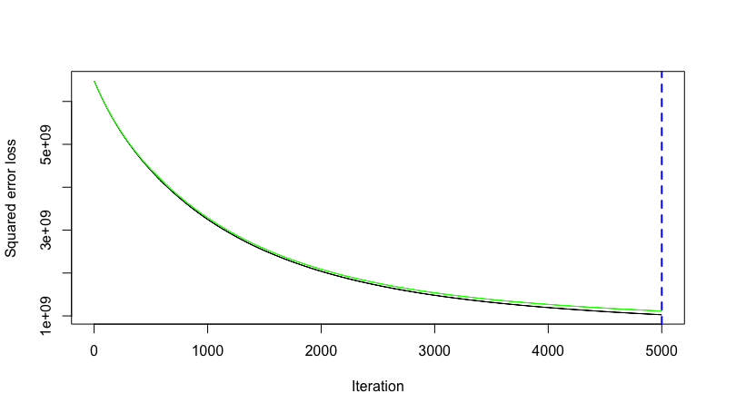

# Gradient Boosting Machines {#GBM}

```{r gbm-ch12-setup, include=FALSE}

# Set the graphical theme
ggplot2::theme_set(ggplot2::theme_light())

# Set global knitr chunk options
knitr::opts_chunk$set(
  cache = TRUE,
  warning = FALSE, 
  message = FALSE, 
  collapse = TRUE, 
  fig.align = "center",
  fig.height = 3.5
)
```

Gradient boosted machines (GBMs) are an extremely popular machine learning algorithm that have proven successful across many domains and is one of the leading methods for winning Kaggle competitions. Whereas random forests (Chapter \@ref(RF)) build an ensemble of deep independent trees, GBMs build an ensemble of shallow and weak successive trees with each tree learning and improving on the previous. When combined, these many weak successive trees produce a powerful “committee” that are often hard to beat with other algorithms. This chapter will cover the fundamentals to understanding and implementing GBMs.

## Prerequisites

For this chapter we’ll use the following packages:

```{r gbm-prereq-pkgs}
library(rsample)  # data splitting
library(gbm)
library(caret)
library(vip)
library(pdp)
```


To illustrate the various concepts we’ll continue focusing on the Ames Housing data (regression); however, at the end of the chapter we’ll also apply fit a random forest model to the employee attrition data (classification).

```{r gbm-prereq-data}
# Create training (70%) and test (30%) sets for the AmesHousing::make_ames() data.
# Use set.seed for reproducibility

set.seed(123)
ames_split <- initial_split(AmesHousing::make_ames(), prop = .7)
ames_train <- training(ames_split)
ames_test  <- testing(ames_split)
```


## The basic idea


## Gradient descent


## Fitting a basic GBM


```{r, eval=FALSE}
# for reproducibility
set.seed(123)

# train GBM model
gbm_mod1 <- gbm(
  formula = Sale_Price ~ .,
  distribution = "gaussian",
  data = ames_train,
  n.trees = 10000,
  interaction.depth = 1,
  shrinkage = 0.001,
  cv.folds = 5,
  n.cores = NULL, # will use all cores by default
  verbose = FALSE
  )  

print(gbm_mod1)
## gbm(formula = Sale_Price ~ ., distribution = "gaussian", data = ames_train, 
##     n.trees = 10000, interaction.depth = 1, shrinkage = 0.001, 
##     cv.folds = 5, verbose = FALSE, n.cores = NULL)
## A gradient boosted model with gaussian loss function.
## 10000 iterations were performed.
## The best cross-validation iteration was 10000.
## There were 80 predictors of which 45 had non-zero influence.
```

```{r, eval=FALSE}
# get MSE and compute RMSE
sqrt(min(gbm_mod1$cv.error))
## [1] 33079.61

# plot loss function as a result of n trees added to the ensemble
gbm.perf(gbm_mod1, method = "cv")
```

```{r, echo=FALSE}

```


## Tuning


```{r, eval=FALSE}
# for reproducibility
set.seed(123)

# train GBM model
gbm_mod2 <- gbm(
  formula = Sale_Price ~ .,
  distribution = "gaussian",
  data = ames_train,
  n.trees = 5000,
  interaction.depth = 3,
  shrinkage = 0.1,
  cv.folds = 5,
  n.cores = NULL, # will use all cores by default
  verbose = FALSE
  )  

# find index for n trees with minimum CV error
min_MSE <- which.min(gbm_mod2$cv.error)

# get MSE and compute RMSE
sqrt(gbm_mod2$cv.error[min_MSE])
## [1] 23813.34

# plot loss function as a result of n trees added to the ensemble
gbm.perf(gbm_mod2, method = "cv")
```

```{r, echo=FALSE}
knitr::include_graphics("illustrations/gbm2_gradient_descent.png")
```


```{r}
gbm_grid <- expand.grid(
  interaction.depth = seq(1, 5, by = 2),
  shrinkage = c(.01, .1, .3),
  n.minobsinnode = c(5, 10, 15),
  n.trees = 5000
)
```


```{block, type="warning"}
This grid search took 51 minutes to complete.
```

```{r, eval=FALSE}
# create train() parameters
features <- subset(ames_train, select = -Sale_Price) %>% as.data.frame()
response <- ames_train$Sale_Price
kfold <- trainControl(method = "cv", number = 5)

# cross validated model
gbm_tune <- train(
  x = features,
  y = response,
  method = "gbm",
  distribution = "gaussian",
  metric = "RMSE",
  tuneGrid = gbm_grid,
  trControl = kfold,
  verbose = FALSE
)

# plot results
ggplot(gbm_tune)
```

```{r, echo=FALSE}
knitr::include_graphics("illustrations/gbm-xval-tuned.png")
```


```{r, eval=FALSE}
# best model
gbm_tune$bestTune
##   n.trees interaction.depth shrinkage n.minobsinnode
## 7    5000                 5      0.01              5
```

Minimum RMSE was \$22,424

```{r, eval=FALSE, echo=FALSE}
# used this code chunk to find minimum RMSE with additional parameters
gbm_grid2 <- expand.grid(
  interaction.depth = 5,
  shrinkage = 0.01,
  n.minobsinnode = 5,
  n.trees = c(5000, 7500, 10000)
)

# create train() parameters
features <- subset(ames_train, select = -Sale_Price) %>% as.data.frame()
response <- ames_train$Sale_Price
kfold <- trainControl(method = "cv", number = 5)

# cross validated model
gbm_tune2 <- train(
  x = features,
  y = response,
  method = "gbm",
  distribution = "gaussian",
  metric = "RMSE",
  tuneGrid = gbm_grid2,
  trControl = kfold,
  verbose = FALSE
)

gbm_tune2$bestTune
##   n.trees interaction.depth shrinkage n.minobsinnode
## 3   10000                 5      0.01              5
min(gbm_tune2$results$RMSE) # --> CV RMSE was 22084.87
```


```{r, echo=FALSE}
# for reproducibility
set.seed(123)

# train GBM model
gbm_final_fit <- gbm(
  formula = Sale_Price ~ .,
  distribution = "gaussian",
  data = ames_train,
  n.trees = 10000,
  interaction.depth = 5,
  shrinkage = 0.01,
  n.minobsinnode = 5,
  n.cores = NULL, 
  verbose = FALSE
  )  
```


## Feature Interpretation


```{r}
vip(gbm_final_fit)
```


```{r}
# PDP plot
gbm_pdp <- gbm_final_fit %>%
  partial(pred.var = "Gr_Liv_Area", n.trees = gbm_final_fit$n.trees, grid.resolution = 100) %>%
  autoplot(rug = TRUE, train = ames_train) +
  ggtitle("PDP plot") +
  scale_y_continuous(labels = scales::dollar)

# ICE curves
gbm_ice <- gbm_final_fit %>%
  partial(pred.var = "Gr_Liv_Area", n.trees = gbm_final_fit$n.trees, grid.resolution = 100, ice = TRUE) %>%
  autoplot(rug = TRUE, train = ames_train, alpha = .1, center = TRUE) +
  ggtitle("Centered ICE curves") +
  scale_y_continuous(labels = scales::dollar)

gridExtra::grid.arrange(gbm_pdp, gbm_ice, nrow = 1)
```


```{r, echo=FALSE}
gbm_final_fit %>%
  partial(pred.var = "Overall_Qual", n.trees = gbm_final_fit$n.trees, train = as.data.frame(ames_train)) %>%
  autoplot() +
  scale_y_continuous(labels = scales::dollar)
```


```{r, echo=FALSE}

gbm_final_fit %>%
  partial(pred.var = "Neighborhood", n.trees = gbm_final_fit$n.trees, train = as.data.frame(ames_train)) %>%
  ggplot(aes(yhat, reorder(Neighborhood, yhat))) +
  geom_point() +
  ylab(NULL) +
  scale_x_continuous(labels = scales::dollar)
```


## Attrition data


```{r, eval=FALSE}
# get attrition data
df <- rsample::attrition %>% dplyr::mutate_if(is.ordered, factor, ordered = FALSE)

# Create training (70%) and test (30%) sets for the rsample::attrition data.
# Use set.seed for reproducibility
set.seed(123)
churn_split <- initial_split(df, prop = .7, strata = "Attrition")
churn_train <- training(churn_split)
churn_test  <- testing(churn_split)

# create a tuning grid
gbm_grid <- expand.grid(
  interaction.depth = seq(1, 5, by = 2),
  shrinkage = c(.01, .1, .3),
  n.minobsinnode = c(5, 10, 15),
  n.trees = c(5000, 10000)
)

# create train() parameters
features <- subset(churn_train, select = -Attrition) %>% as.data.frame()
response <- churn_train$Attrition
kfold <- trainControl(method = "cv", number = 10)

# cross validated model
gbm_churn <- train(
  x = features,
  y = response,
  method = "gbm",
  distribution = "bernoulli",
  tuneGrid = gbm_grid,
  trControl = kfold,
  verbose = FALSE
)

gbm_churn$bestTune
##   n.trees interaction.depth shrinkage n.minobsinnode
## 1    5000                 1      0.01              5
min(gbm_churn$results$RMSE)
## [1] 0.8718578
```


```{r gbm-attrition-model-comparison, echo=FALSE, eval=FALSE}
# train logistic regression model
glm_mod <- train(
  Attrition ~ ., 
  data = churn_train, 
  method = "glm",
  family = "binomial",
  preProc = c("zv", "center", "scale"),
  trControl = trainControl(method = "cv", number = 10)
  )

# train regularized logistic regression model
penalized_mod <- train(
  Attrition ~ ., 
  data = churn_train, 
  method = "glmnet",
  family = "binomial",
  preProc = c("zv", "center", "scale"),
  trControl = trainControl(method = "cv", number = 10),
  tuneLength = 10
  )

# train mars model
hyper_grid <- expand.grid(
  degree = 1:3, 
  nprune = seq(2, 100, length.out = 10) %>% floor()
  )
tuned_mars <- train(
  x = subset(churn_train, select = -Attrition),
  y = churn_train$Attrition,
  method = "earth",
  trControl = trainControl(method = "cv", number = 10),
  tuneGrid = hyper_grid
)

# train rf model
hyper_grid <- expand.grid(
  mtry            = seq(3, 18, by = 3),
  min.node.size   = seq(1, 10, by = 3),
  splitrule       = c("gini", "extratrees")
  )
tuned_rf <- train(
  x = subset(churn_train, select = -Attrition),
  y = churn_train$Attrition,
  method = "ranger",
  trControl = trainControl(method = "cv", number = 10),
  tuneGrid = hyper_grid,
  num.trees = 500,
  seed = 123
)

# train gbm model
gbm_grid <- expand.grid(
  interaction.depth = 1,
  shrinkage = 0.01,
  n.minobsinnode = 5,
  n.trees = c(5000, 10000)
)
gbm_churn <- train(
  x = features,
  y = response,
  method = "gbm",
  distribution = "bernoulli",
  tuneGrid = gbm_grid,
  trControl = trainControl(method = "cv", number = 10),
  verbose = FALSE
)

# extract out of sample performance measures
gbm_attrition_model_comparison <- summary(resamples(list(
  Logistic_model = glm_mod, 
  Elastic_net = penalized_mod,
  MARS_model = tuned_mars,
  RF_model = tuned_rf,
  GBM_model = gbm_churn
  )))$statistics$Accuracy

saveRDS(gbm_attrition_model_comparison, file = "data/gbm_attrition_model_comparison.rds")
```

```{r, echo=FALSE}
readRDS("data/gbm_attrition_model_comparison.rds") %>%
  kableExtra::kable() %>%
  kableExtra::kable_styling(bootstrap_options = c("striped", "hover"))
```


## Final thoughts


## Learning more
